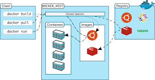
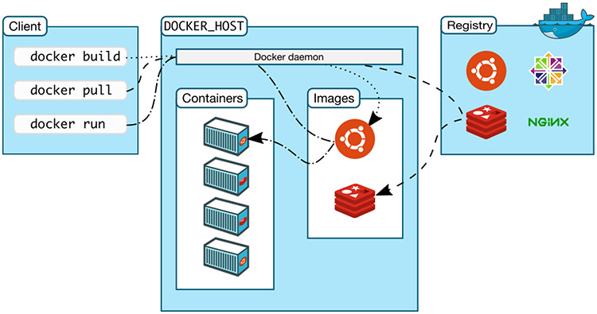
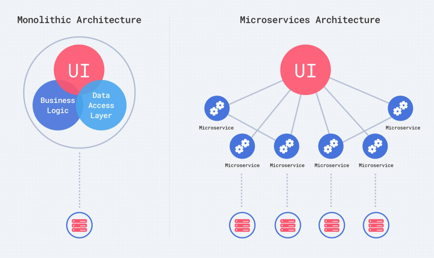

# What is Containerisation Docker



Docker is a containerisation platform, open source platform, that enables developers to seperate their applications from their infrastructure. It does this by utilising containers.  
Containers images are lightweight, standalone, executable packages of software that include everything needed to run an application: code, runtime, system tools, system libraries and settings.

Containers sit on top of a physical server and its host Operating System. Each container shares the host OS kernel and uses its binaries and libraires. The shared components are only read by the container and can't be changed by it. The container then will install only the libraries that are not included

In that way they reduce the overhead required to run them, and they can 'simulate' an operating system with fewer resources, and much less space.

- Containerization is the process of packaging software code, its required dependencies, configurations, and other detail to be easily deployed in the same or another computing environment. In simpler terms, containerization is the encapsulation of an application and its required environment.

- Docker is a set of platform as a service products that use OS-level virtualization to deliver software in packages called containers. Containers are isolated from one another and bundle their own software, libraries and configuration files; they can communicate with each other through well-defined channels.

## Why docker

Developing apps today requires so much more than writing code. Multiple languages, frameworks, architectures, and discontinuous interfaces between tools for each lifecycle stage creates enormous complexity. Docker simplifies and accelerates your workflow, while giving developers the freedom to innovate with their choice of tools, application stacks, and deployment environments for each project.

- Lightweight, portable and self-contained. Docker containers make it easier to build software along forward-thinking lines, so that you’re not trying to solve tomorrow’s problems with yesterday’s development methods.

- Open source containerisation platform which can communicate with any OS.

- Shares resources of OS, rather than holding on to them (like a VM).

- Containerises apps for fast and consistency delivery: improved developer productivity.

- Industry standard, efficent operation and ease of use.

- Greater resource efficiency: With containers, you can run several times as many copies of an application on the same hardware as you can using VMs. This can reduce your cloud spending.

## Difference between Docker and VM


Due to their reduced overhead, containers are very fast and lightweight. They can therefore offer the same functionality with VM much more easily.

A container is similar to a Virtual Machine in that both are closed boxes (separated from the host machine) on which to run software. The main difference between a VM and a container is that while a virtual machine simulates the whole operating system on which to run software, a container is only provided with the minimal necessary dependencies to run a specific application, and is therefore much more lightweight and faster, but while trading-off flexibility and scope.

Virtualization enables you to run multiple operating systems on the hardware of a single physical server, while containerization enables you to deploy multiple applications using the same operating system on a single virtual machine or server.

So, the difference are:

- Docker is much more lightweight (takes up less space, resources).
- Start-up time is much faster. Faster, in any situation.
- Can integrate with other tools.
- Easily adapt it.
- You can run multi containers, because it shares the operating system.
- They don not need the whole operating system.

## Docker working diagram:



__- First we have the client on the left:__

This is where we’re running various Docker commands. The client could be installed on your laptop running Windows, MacOS or a server running Linux, it doesn’t matter.

__- Next up, we have the Docker host:__

It contains container, images, and Docker daemon. It offers a complete environment to execute and run your application.

This is typically referred to as the server running the Docker daemon. That makes sense right? It’s the host that happens to be running the Docker daemon.

It’s very simple to configure the Docker client to connect to a remote Docker host. This is one way you’re able to run Docker on MacOS and Windows.

In that case, the Docker daemon ends up running in a virtual machine that uses Linux, and the Docker client is configured to connect to that remote Docker host.

The key take away here is, the client and daemon does not need to be on the same box.

__- Lastly, we have the registry:__

Which is also part of the Docker ecosystem but for now you can ignore it. Discussing what that does goes beyond the scope of this article, but it would have looked weird if I chopped it out because then the arrows would be coming from no where.

One more thing: What is a Docker Swarm?

A Docker Swarm is a group of either physical or virtual machines that are running the Docker application and that have been configured to join together in a cluster. Once a group of machines have been clustered together, you can still run the Docker commands that you're used to, but they will now be carried out by the machines in your cluster. The activities of the cluster are controlled by a swarm manager, and machines that have joined the cluster are referred to as nodes.

What is used for?: Docker swarm is a container orchestration tool, meaning that it allows the user to manage multiple containers deployed across multiple host machines.

One of the key benefits associated with the operation of a docker swarm is the high level of availability offered for applications. In a docker swarm, there are typically several worker nodes and at least one manager node that is responsible for handling the worker nodes' resources efficiently and ensuring that the cluster operates efficiently.

## Docker Installation and setup

To install docker on ubuntu, click and follow the steps on this [link](https://docs.docker.com/engine/install/ubuntu/)

## Docker hub account and repo

Docker Hub is an online repository for docker images. It can be used to store images on the cloud, share them to your team, or in public.

To register any docker that the client want to build.

Docker has version control component that is very simmilar to GitHub, its called Docker Hub and it allows us to create repositories to store our images in. You can create a repository directly from the dockerhub webpage or automatically create one by pushing an image to a valid namspace.  

All docker repositories use the format `username/repo_name`, this is the name you should push your images to.

To create an account, click on the [link](https://hub.docker.com/)

On the task we will see how to push it.

## Docker containers and images

- Containers: Isolated environments that run an instance of an image. A container is a standard unit of software that packages up code and all its dependencies so the application runs quickly and reliably from one computing environment to another.

- Images: A read only template that contains set instructions for creating a container. Docker images contain executable application source code as well as all the tools, libraries, and dependencies that the application code needs to run as a container. When you run the Docker image, it becomes one instance (or multiple instances) of the container.

## Mircroservice

Docker shines for microservices architecture. Lightweight, portable, and self-contained, Docker containers make it easier to build software along forward-thinking lines, so that you’re not trying to solve tomorrow’s problems with yesterday’s development methods.

Microservices are tiny apps that are meant to do one thing only with as little context as possible.  
Ideally they should perform only one task and stopping them should not affect any other workstream  
or action.

THe idea is to split your application into a set of smaller, inter-connected services that are:

1. Highly maintainable and testable.
2. Loosely coupled.
3. Independently deployable.
4. Organised around business capabilities.
5. Owned by small teams.

Microservices (or microservices architecture) are a cloud native architectural approach in which a single application is composed of many loosely coupled and independently deployable smaller components, or services.

While much of the discussion about microservices has revolved around architectural definitions and characteristics, their value can be more commonly understood through fairly simple business and organizational benefits:

- Independent 100%.
- Code can be updated more easily - new features or functionality can be added without touching the entire application
- Teams can use different stacks and different programming languages for different components.
- Components can be scaled independently of one another, reducing the waste and cost associated with having to scale entire applications because a single feature might be facing too much load.
- Service reusability: DRY principle.
- Service autonomy.
- Improved Scalability.
- Better Data security and Compliance.
- Faster time to market.



Monolithic architecture  is built as one large system and is usually one code-base and Microservices architecture is built as small independent module based on business functionality. Only for small projects, not for large business.

Before microservices, the monolith has limitations and complexity. Heavy apps can slow down the start up time. Each updates result into repdeploying the full stack app and challeging to scale up on demand.

Developing in microservices is the art of breaking down the old model of building one large application, i.e. a “monolithic” application, and forming a new model where specialized, cloud-hosted sub applications—each charged with a very specific task—work together. Microservices distributes application load and can help ensure stability with replicable, scaleable services interacting with each other.

- Who is using?

Everyone is using microservices. -> Netflix, spotify, uber, ebay, etc.

- Best practice to adopt Mircro-Services:

Use docker to containerize and orchestration with kubernetes.

- When to Use Microservices:

1. When you want your monolithic application to accommodate scalability, agility, manageability and delivery speed
2. When you have to rewrite legacy applications in today’s programming languages or tech stacks to keep up with modern-day business requirements and solutions
3. When you have standalone business applications or modules that have to be reused across diverse channels—some good examples would be login services, search options, authentication facilities and more
4. If you’re building a highly agile application (product or service) that demands swift speed of delivery, innovation and more

- When to Not Use Microservices:

1. Using microservices can prove to offer contrary consequences if you don’t have a team size that cannot handle the tasks involved. This will only result in the delay of delivery.
2. Microservices are solutions to complex concerns and if your business doesn’t have complex issues, understand that you don’t have a system in place to handle the complexities of microservices.

## Kubernetes

Kubernetes — also known as “k8s” or “kube” — is a container orchestration platform for scheduling and automating the deployment, management, and scaling of containerized applications.

Kubernetes is a containerisation orchestration tool that that facilitates both declarative  
configuration and automation. It is widely available and enables convenient managment of a lot of  
different containerisation services.  

- Kubernetes manages containers for over 69% of companies.

_Benefits:_

1. Widely available.
2. Self-healing: Automatically spin up another container if some of them fail.
3. Secret and configuration managment.
4. Automated rollout.
5. Storage managment.
6. Load balancing.
7. Adopted by all cloud providers.
8. Auto Scaling.
9. Save money by optimizing infrastructural resources thanks to the more efficient use of hardware.
10. Run everywhere.

- How do you manage the behaviours of your containers?: you can auto scaling, check helper, in all the containers.

- Kubernetes dominates container orchestration market. Every cloud could be adopted, have they own manage services.

- Multi stage images?

Containerization: we use docker. Sparta test app, was a node app, so we containerize this in a docker. But how we can auto scale if there are a lot of traffic, we use kubernetes to deplay the images of the docker.

## Building customised images, microservice

After pulling an image and creating a container out of that image, you can simply do the following:   
- `docker ps -a` - find the container id of the container you want to turn into an image.
- `docker commit <container_id> <name_of_repo>` - then commit it to a new image, note `<name_of_repo>` should contain `username/name`. 
- `docker push <name_of_repo>:<tag>` - This pushes it, `<tag>` is usualy `latest`.

We will see an example on the tasks.

## Docker commands - Docker containers and images:

- `docker --version`: Check the docker version
- `docker run hello-world`: to download and run directly the docker
- `docker images`: List all images that are stored localy.
- `docker rmi hello-world -f`: delete an image, -f is force.
- `docker pull hello-world`: to download the image but no running. If you want to make sure that it is your image.
- `docker run hello-world`
- `docker ps`: to check the containers
- `docker ps -a`: checking running containers for all
- `docker run img_name`: This will pull and then containerise an image
    - `-d` - Detached
    - `-p local_port:container_port` - Map a port 
	- `--name` - Name the container
- `docker start container_id`:Start up a container

__Stages:__
- pull
- check the images
- ps to see in the containers exists

__To create a docker with a specific image:__
- `docker pull ghost`
- `docker images`
- `docker ps`
- `docker run -d -p 2368:2368 ghost`
- go to the browser

__To delete a docker:__
- `docker ps` and copy de container ID
- `sudo docker rm 4e274a3b2474 -f`: to force

__To delete a docker but firt stopping it:__

- `docker stop container_id` - Stop a running container
- `docker rm -f container_id` - Delete a container, `-f` is force

__Pull and run:__
- `sudo docker run -d -p 88:80 nginx`: it pulled and runned. It is going to use port 88 on our localhost, and it wants to catch the traffic from port 80 which is the one used by default nginx.
- Go the browser `localhost:88`

__Go to inside of the docker:__
- We need the container ID `docker ps`
- `docker exec -it 19aa73f56a0d sh` to go inside of the shell of the container.
- Inside: `cd /usr/share/nginx/html`, then `apt-get install nano`, go inside `nano index.html` and modify the title.
- Go again to the browser and refresh and boom! You can see the magic. We do not need to restart anything.

## Task

- Create docker hub account and a repo called eng84 on docker hub.
- Build a customised image with the index.html that we created together in the class (In our local machine).
- Push the image to your docker hub repo.

_Solution:_

- How to create an image with the new `index.html` file:

1. Run a docker with nginx server:

`docker run -d -p 88:80 nginx` -> it pulled and runned.

2. Go to your browser: `localhost:88` -> you will see the nginx service.

3. Let's create a new `index.html` in your localhost `sudo nano index.html`:

````
<html>
<head>
<title>HI JOSE</title>
</head>
<body><h1> This file is inside the OS and using docker cp command to copy into nginx container's location docker cp index.html /usr/share/nginx/html/ HELLO JOSE </h1></body>

</html>
````

4. Copy from your local machine to the container:

`docker cp index.html ID_or_name_of_your_docker:/usr/share/nginx/html/index.html`

5. Create an Image from a Cointainer:

So at this point, we’ve updated the contents of a running container and as long as we keep that container around, we don’t need to do anything.

However, we want to know how to save this container as an image so we can make other containers based on this one. 

`docker commit ID_or_name_of_your_docker`

6. Now look at the docker images list:

`docker images`

And tag the new image: `docker tag ID_new_images name_tag`

Or you can do it directly: `docker commit ID_or_name_of_your_docker new_name_image`

7. Stop your actual container and create a new one:

`docker stop ID_or_name_of_your_docker`

`docker rm ID_or_name_of_your_docker`

8. Finally create a new container based on the image we just created and start it:

`docker run --name jose_docker_nginx -d -p 88:80 name_new_image_created`

Check is working:

`docker ps` and go to the browser and enter: `localhost:88` and you will see your new html updated.

- How to push the image to your docker hub repository:

1. Log in: `docker login`

2. Run `docker images` and copy the name of the image that you want to push it.

3. Then we create a new image with a new tag name that should be the name of your account/the name of the repository:

`docker tag new_nginx_jose:latest josetorres31/eng84_jose_nginx:latest`

4. Before pushing see if the new image was created: `docker images`. If everything is right: `docker push josetorres31/eng84_jose_nginx:latest`.

5. Go to your Docker hub account to check that. Then try to pull to see if everything is right -> AMAZING!
